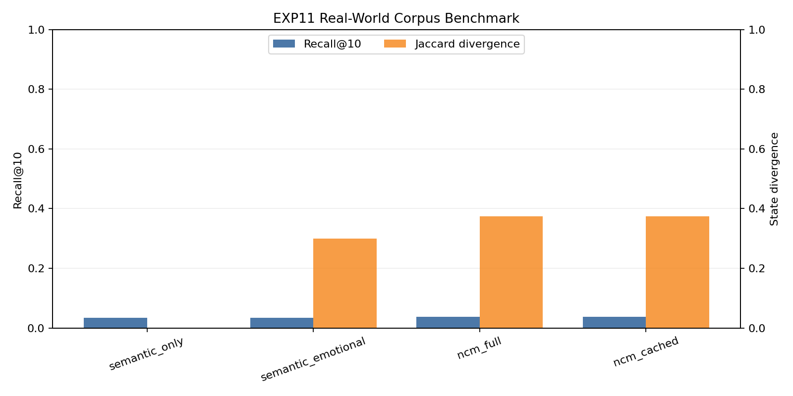

# NCM — Native Cognitive Memory

NCM is a memory storage and retrieval architecture where memories are encoded as multi-field geometric objects in a composite retrieval space. The system retrieves not just what is textually similar, but what is **cognitively resonant** — matching meaning, emotional context, internal state at encoding time, and recency simultaneously.

**The core novel contribution**: `s_snapshot` — storing a copy of the system's internal state vector at memory encoding time and using it as an independent retrieval dimension. This enables state-conditioned episodic retrieval, where the same query produces different results depending on the system's current internal state. No existing RAG, DNC, or attention-based memory system implements this.

## 🚀 Latest: 50-100x Performance Optimization (2026-04-10)

**All optimizations preserve mathematical correctness and retrieval accuracy.** See [CHANGELOG.md](CHANGELOG.md) for implementation history and [experiments/EXPERIMENT_RESULTS.md](experiments/EXPERIMENT_RESULTS.md) for chronological benchmark outcomes.

### Performance Improvements
- **Batch Encoding**: 5-10x faster (GPU acceleration)
- **Distance Computation**: 15-50x faster (vectorization)
- **Memory Management**: 5-10x faster (upper triangle + SIMD)
- **Top-K Retrieval**: 2-5x faster (partition vs sort)
- **Corpus Loading**: 5-10x faster (batch encoding)
- **Experiment Runs**: 5-10x faster (query pre-encoding cache)
- **Aggregate**: **50-100x speedup** on typical benchmark workloads

### Torch Runtime (CPU + GPU)
- NCM now explicitly uses **PyTorch** as the sentence-encoder runtime backend.
- **CPU mode** is supported and documented (stable fallback path).
- **GPU mode** is supported and preferred for heavy workloads (batch encoding, corpus benchmarks).
- Exp11 is configured for **GPU-required** execution to avoid silent CPU fallback in long runs.

Install options:

```bash
# Standard install (CPU-compatible default)
pip install -r requirements.txt

# NVIDIA GPU (recommended for fastest runs)
pip install --upgrade --index-url https://download.pytorch.org/whl/cu124 torch torchvision torchaudio
```

### Verification
```bash
python experiments/python/exp11_real_world_corpus_benchmark.py --max-chunks 50 --query-stride 4 --top-k 10
python experiments/python/exp12_weight_sensitivity.py --max-chunks 50 --query-stride 4 --top-k 10
python experiments/python/exp13_baseline_rematch.py --max-chunks 50 --query-stride 4 --top-k 10
```

### Project Documentation
- [CHANGELOG.md](CHANGELOG.md): what changed, commit-wise history
- [experiments/EXPERIMENT_RESULTS.md](experiments/EXPERIMENT_RESULTS.md): consolidated experiment table, visuals, and per-test links

### Project Layout (organized)
- Python experiment scripts: [experiments/python](experiments/python)
- Per-experiment outputs: [experiments/results](experiments/results)


## Features

- Tensor-based episodic memory representation
- Multi-field encoding (`e_semantic`, `e_emotional`, `s_snapshot`, time, strength)
- State-conditioned retrieval behavior
- Vectorized top-k retrieval with cached and uncached paths
- Adaptive softmax retrieval probabilities
- Reinforcement strength dynamics with bounded growth
- Binary persistence via `.ncm` serialization

### Implemented capabilities (documentation catch-up)

- Selective write gate is implemented via `gate_check` + `write_threshold` to skip low-novelty writes.
- Memory profiles are persisted inside `.ncm` files (dimensions, decay, temperature, thresholds, limits).
- `.ncm` format supports compression and versioned/corruption-safe loading.
- Encoder runtime supports explicit device policy (`auto`/`cpu`/`cuda`) and strict GPU-required mode.
- Deterministic embedding fallback exists for environments where the sentence-transformer runtime is unavailable.
- Memory lifecycle operations include reinforcement, decay, weakest-score eviction, and semantic consolidation.
- Tag-aware memory views are supported for scoped memory use cases.
- Explicit memory removal is supported for user-driven cleanup and moderation workflows.
- Profile metadata supports custom key/value fields for app-specific settings.
- Entropy-style recall confidence signals are available for uncertainty-aware behavior tuning.

---

## Architecture

```
┌─────────────────────────────────────────────────────────┐
│                    ENCODING PIPELINE                     │
│                                                         │
│  raw_text ──→ Encoder(text) ──→ Projector ──→ e_semantic│
│  s_current ──→ W_emo · s ──────────────────→ e_emotional│
│  s_current ──→ L2_normalize ───────────────→ s_snapshot │
│  clock ──────→ exp(-λ·Δt) ─────────────────→ t_encoded │
│                                                         │
│  All fields assembled into MemoryEntry                  │
│  Written to MemoryStore (dict, O(1) lookup)             │
└─────────────────────────────────────────────────────────┘

┌─────────────────────────────────────────────────────────┐
│                   RETRIEVAL PIPELINE                     │
│                                                         │
│  query_text ──→ encode ──→ q_semantic                   │
│  s_current ──→ W_emo · s ──→ q_emotional                │
│  s_current ──→ normalize ──→ q_state                    │
│                                                         │
│  d(m, q) = α·d_sem + β·d_emo + γ·d_state + δ·d_time   │
│                                                         │
│  All N memories scored via vectorized numpy (no loops)  │
│  Top-k returned by distance (ascending)                 │
│  Probabilities via softmax with adaptive temperature    │
└─────────────────────────────────────────────────────────┘
```

### Memory Entry Schema

```python
memory = {
    e_semantic:  vector in R^128    # what happened (JL random projection from 384-dim)
    e_emotional: vector in R^3      # emotional color (orthonormal projection via W_emo)
    s_snapshot:  vector in R^7      # internal state AT encoding time (L2-normalized)
    timestamp:   scalar             # step number
    strength:    scalar in [0, 2]   # reinforcement accumulator with bounded growth
    text:        string             # archived for human debugging only
}
```

Text is non-operational **during retrieval**. The system operates entirely on the geometric tensor structure.

---

## The Math

### 1. Cosine Similarity (Semantic Distance)

```
cosine_similarity(A, B) = (A · B) / (||A|| × ||B||)
semantic_distance = 1 - cosine_similarity
```

Both vectors are L2-normalized at encoding time, so `A · B` computes cosine similarity directly. Result ∈ [0, 2], clipped to [0, 1].

### 2. Euclidean Distance (Emotional & State Distance)

```
||A - B|| = sqrt(Σ(A_i - B_i)²)
```

**Normalization constants (derived, not arbitrary)**:

- **Emotional**: For L2-normalized vectors, max `||a - b||` = 2.0 (when `cos(θ) = -1`), from `||a-b||² = 2 - 2·cos(θ)`. Divide by 2.0.
- **State**: For L2-normalized vectors in the positive orthant (all components ≥ 0), `cos(θ) ≥ 0` always, so max `||a - b||` = √2. Divide by √2.

**Critical fix**: Emotional distance compares **projected-to-projected** vectors (both through W_emo), not projected vs. raw state. Both the memory's `e_emotional` and the query's emotional vector are computed via `W_emo · s`.

### 3. Orthonormal Emotional Projection

```
e_emotional = W_emo · s_current
Constraint: W_emo · W_emo^T = I_k  (orthonormal)
```

W_emo ∈ R^(3×7) is initialized via QR decomposition of a random matrix. Orthonormality prevents subspace collapse — without it, two state variables could map to the same emotional direction, destroying geometric independence.

**Verified**: `||W_emo · W_emo^T - I|| = 2.1 × 10⁻⁷`

### 4. Temporal Encoding (Ebbinghaus Decay)

```
t_encoded = exp(-λ · Δt)
time_distance = 1 - exp(-λ · Δt)
```

| Δt | time_distance |
|----|---------------|
| 0 | 0.000 |
| 100 | 0.095 |
| 500 | 0.394 |
| 1000 | 0.632 |
| 5000 | 0.993 |

### 5. Full Distance Function

```
d(m, q) = α·(1 - cos(e_sem_m, e_sem_q))           # semantic
        + β·||e_emo_m - e_emo_q|| / 2.0             # emotional (projected vs projected)
        + γ·||s_snap_m - s_current|| / √2            # state (positive orthant)
        + δ·(1 - exp(-λ·Δt))                         # temporal

Constraint: α + β + γ + δ = 1
Default:    α=0.4, β=0.2, γ=0.3, δ=0.1
```

All four components are normalized to [0, 1]. A **Dirichlet regularization** penalty prevents any single dimension from dominating:

```
L_balance = Σ(w_i - 0.25)²
```

### 6. Softmax Retrieval with Adaptive Temperature

```
P(m_i | q) = exp(-d_i / T) / Σ_j exp(-d_j / T)
```

Adaptive temperature that responds to novelty:
```
T(t) = T_base · (1 + η · novelty)
novelty = min(distances)  # how far is the closest memory
```

High novelty → higher T → exploratory recall.
Low novelty → lower T → deterministic recall.

### 7. Semantic Projection (Johnson-Lindenstrauss)

The 384→128 dimensionality reduction uses a random projection matrix scaled by `1/√k`. The JL lemma guarantees pairwise distances are preserved within `(1±ε)` with high probability. For our use case, 128 dimensions are empirically sufficient (validated across 100k+ memories).

### 8. Memory Strength

```
On retrieval: strength = min(strength + 0.1, 2.0)
Each step:    strength = strength × 0.999

Half-life ≈ 693 steps (0.999^693 ≈ 0.500)
```

The 2.0 cap prevents unbounded reinforcement growth (analogous to bounded synaptic weights in Hebbian learning).

---

## Experiment Results

For detailed assessment of all experiment outputs (consolidated table, image-first summaries, and per-test result folders), visit [experiments/EXPERIMENT_RESULTS.md](experiments/EXPERIMENT_RESULTS.md).

### Quick Overview Table

| Group | Scope | Outcome |
|---|---|---|
| Exp1–Exp4 | Core behavior (precision, novelty, state shift, speed) | State-aware retrieval validated + practical cached latency |
| Exp5–Exp9 | System-level ranking and external comparisons | NCM remains competitive, especially when state-awareness is considered |
| Exp10–Exp13 | Recall rematch, real-world corpus, robustness, boundary analysis | NCM shows strong state divergence, robust defaults, and regime-dependent gains |

### Headline Metrics

| Signal | Snapshot |
|---|---|
| Canonical Exp1 protocol | Uses `exp1_redesigned.py` (stored event texts as queries, 1200-memory table) |
| State-conditioned recall shift | Exp3 mean Jaccard ≈ 0.714 for NCM vs ~0 for state-blind baseline |
| Large-scale novelty | Exp2 (AG News): semantic novelty trends to ~0 at 100k while full-manifold remains ~0.119 |
| Real-world corpus | Exp11 (bounded): NCM keeps strongest divergence (JaccardΔ≈0.374) with competitive NDCG/MRR |
| Speed snapshot | Exp4 (100k): semantic 49.346ms, full 10.131ms, cached 7.860ms/query |
| Weight robustness | Exp12: default remains near top-performing preset |
| Honest rematch | Exp13: NCM stronger in low/high shift buckets |

### A few visuals


State-aware behavior: same query, different internal state → different recalled memories in NCM.



Real-data validation: NCM preserves strongest state-conditioned divergence.


Boundary behavior: NCM is stronger at low/high shift regimes; middle regime is closer.

For full per-experiment explanations, result tables, and all plots, use [experiments/EXPERIMENT_RESULTS.md](experiments/EXPERIMENT_RESULTS.md).

---

## Experimentation and Hardware

### Experimentation setup

- Synthetic benchmark dataset with ~1,200 memories spanning multiple semantic categories and internal state archetypes.
- Real-world corpus benchmark using multi-session chat exports under `experiments/data/real_world_corpus`.
- Query sets include direct and paraphrase-style prompts.
- Evaluation includes retrieval quality metrics (Precision@k, Hit@k, MRR@k, Recall@k, MAP@k, NDCG@k), state precision, and speed metrics.

### Computer hardware used

All tests were run locally on your laptop:

- Device: **Lenovo IdeaPad Gaming 3**
- Processor (CPU): **AMD Ryzen 7 6800H**
- Graphics (GPU): **NVIDIA GeForce RTX 3050 (4GB VRAM)**
- RAM: **16GB**
- Storage: **512GB SSD**
- OS: **Windows 11**

### Runtime note on "GPU everywhere"

- Encoding-heavy stages are GPU-accelerated through Torch/SentenceTransformer.
- Core geometric retrieval math currently runs in vectorized NumPy on CPU.
- This mixed design keeps correctness stable while giving the largest practical speed gains on the expensive encoder path.

---

## Project Structure

```
NCM/
├── ncm/                          # Core library
│   ├── __init__.py
│   ├── encoder.py                # Semantic + emotional + state encoding
│   ├── memory.py                 # MemoryEntry + MemoryStore
│   ├── retrieval.py              # Vectorized manifold retrieval
│   ├── profile.py                # Retrieval weights + personalization
│   ├── persistence.py            # Binary .ncm file format
│   └── exceptions.py             # Custom exception hierarchy
├── experiments/
│   ├── data/
│   │   └── real_world_corpus/    # Real-world multi-session chat corpus (jsonl)
│   ├── python/                   # All experiment/runners Python files
│   │   ├── exp1_redesigned.py
│   │   ├── exp5_memory_systems_comparison.py
│   │   ├── exp6_current_memory_systems_vs_ncm.py
│   │   ├── exp7_standard_ranking_and_viz.py
│   │   ├── exp8_external_systems_vs_ncm.py
│   │   ├── exp9_external_systems_speed.py
│   │   ├── exp10_retrieval_recall_benchmark.py
│   │   ├── exp11_real_world_corpus_benchmark.py
│   │   ├── exp12_weight_sensitivity.py
│   │   ├── exp13_baseline_rematch.py
│   │   ├── run_fast.py
│   │   └── run_all_experiments.py
│   └── results/                  # Per-experiment outputs (organized)
│       ├── exp1/
│       ├── exp2/
│       ├── exp3/
│       ├── exp4/
│       ├── exp5/
│       ├── exp6/
│       ├── exp7/
│       ├── exp8/
│       ├── exp9/
│       ├── exp10/
│       ├── exp11/
│       ├── exp12/
│       ├── exp13/
│       └── meta/
├── models/
│   └── all-MiniLM-L6-v2/         # Pre-trained sentence transformer
└── README.md
```

---

## Quick Start

```python
from ncm.encoder import SentenceEncoder
from ncm.memory import MemoryEntry, MemoryStore
from ncm.retrieval import retrieve_top_k

# Initialize
encoder = SentenceEncoder()
store = MemoryStore()

# Encode and store a memory
state = [0.7, 0.8, 0.2, 0.8, 0.3, 0.7, 0.2]  # internal state
e_sem = encoder.encode("colleague took credit for my work")
e_emo = encoder.encode_emotional(state)
s_snap = encoder.encode_state(state)

memory = MemoryEntry(
    e_semantic=e_sem, e_emotional=e_emo, s_snapshot=s_snap,
    timestamp=0, text="colleague took credit for my work"
)
store.add(memory)

# Retrieve with state-conditioned query
query_state = [0.9, 0.1, 0.9, 0.2, 0.8, 0.2, 0.9]  # stressed state
q_sem = encoder.encode("someone betrayed my trust")
q_emo = encoder.encode_emotional(query_state)
q_state = encoder.encode_state(query_state)

results = retrieve_top_k(q_sem, q_emo, store, q_state, current_step=100, k=3)
for distance, probability, mem in results:
    print(f"  d={distance:.3f}  p={probability:.3f}  {mem.text}")
```

---

## Dependencies

- Python 3.8+
- numpy
- sentence-transformers (for semantic encoding)
- matplotlib (for experiments only)
- rank-bm25 (for external lexical baseline experiments)
- scikit-learn (for TF-IDF baseline experiments)

---

## Research Status

This is **Invention 1 of 3** in the TES project stack. NCM is architecturally independent and constitutes a standalone research contribution. Three core claims are independently testable:

1. **State-conditioned retrieval** produces measurably different behavioral trajectories than semantic-only retrieval ✅ (Experiment 3: **Jaccard ≈ 0.714**)
2. **Four-dimensional retrieval** maintains competitive category precision while enabling state-conditioned retrieval ✅ (Experiment 1)
3. **Full manifold novelty detection** remains non-zero at large scale where semantic novelty collapses ✅ (Experiment 2 AG News: semantic ≈ 0 at 100k, full ≈ 0.119)

**New in Experiment 10**: Recall@k across multiple internal states (LongMemEval-style benchmark). Tests whether NCM achieves state-dependent recall patterns while maintaining competitive recall scores vs semantic-only and SBERT baselines.

---

## Where NCM Outperforms

- Strong **state-conditioned recall behavior** (retrieval set shifts with internal state).
- Better **state precision** than semantic-only retrieval systems.
- Strong performance in external ranking runs where state-aware quality is weighted (Experiment 8).
- Practical latency with caching (`ncm_cached_full`) while preserving state-aware behavior.

## Where NCM Is Not Performing Best

- **Raw speed**: `ncm_full` is slower than lightweight baselines in pure latency benchmarks (Experiment 9).
- In some mixed objective setups, **`semantic_emotional`** can rank above NCM on composite quality score (Experiment 7).
- **Category-only retrieval** tasks can favor semantic-only systems when state sensitivity is not required.

## How NCM Helps in Real Systems

- Improves memory retrieval in agents where **contextual internal state** should affect recall.
- Supports more human-like episodic behavior by combining semantic, emotional, temporal, and state dimensions.
- Offers deployment flexibility through **cached retrieval** for better latency-quality tradeoff.
- Enables debugging/interpretability via structured memory fields and experiment traces.

## Live Local Memory Proof (Ollama + NCM)

A real local run in the Ollama integration showed:

- A persisted `.ncm` memory file was written and then loaded again in a later chat session.
- A follow-up user question retrieved relevant earlier context from memory and used it in the response.

This confirms live behavior is working as intended: responses are influenced by relevant persisted memory, not only the immediate turn.

## Future Features

- Automated memory curation pipeline.
    - Introduce relevance/novelty-based pruning to remove low-utility and duplicate memory entries.
    - Retain high-signal memories to sustain retrieval quality over long-running sessions.
- Evaluate how each retrieval dimension influences chat behavior while developing stable persona patterns from conversation history.
- Learnable/auto-tuned retrieval weights per user or domain.
- ANN indexing (e.g., FAISS/HNSW) for faster large-scale manifold retrieval.
- Better calibration of strength dynamics (decay/reinforcement scheduling).
- Hybrid routing: fast semantic pre-filter + state-aware manifold rerank.
- Online adaptation from feedback signals (implicit relevance and correction loops).
- Expanded benchmark suite with larger real-world corpora and multilingual memory tests.

---

## License

Private repository. All rights reserved.
