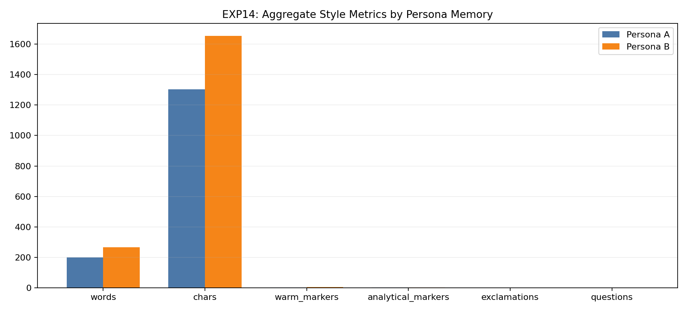
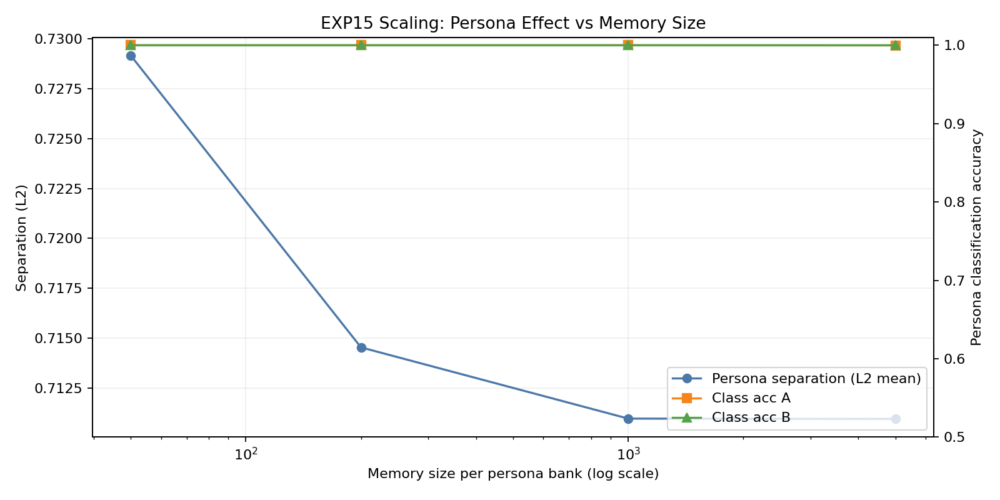
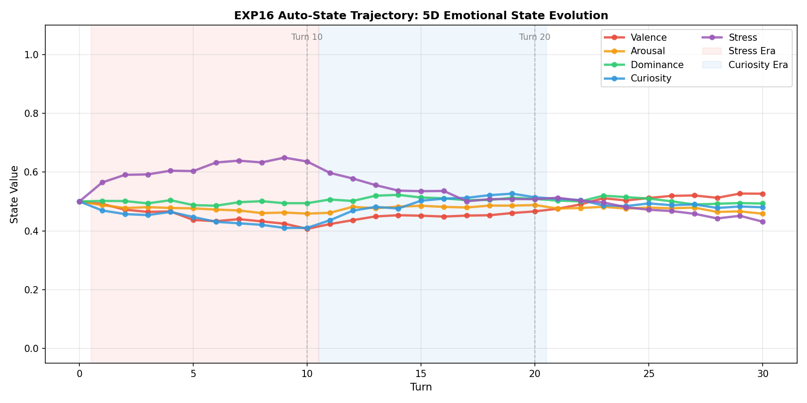
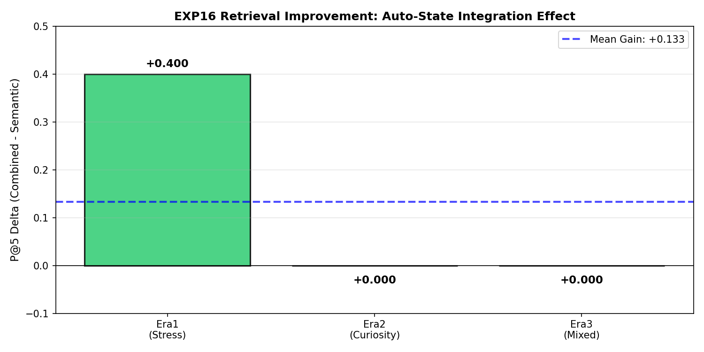
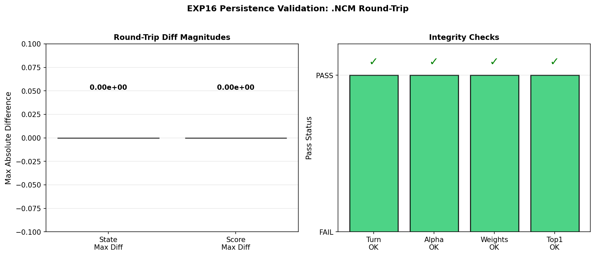
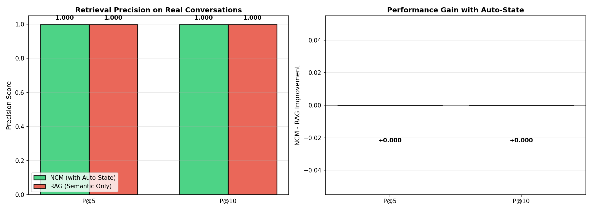
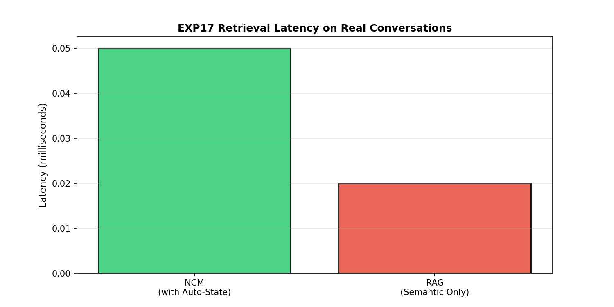
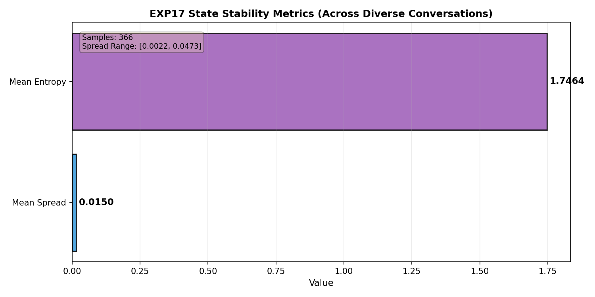

# NCM — Native Cognitive Memory

## Proven Result: Memory-Conditioned Behavior Shift

NCM is now experimentally validated to produce **different response behavior from the same base model** by changing only retrieved memory context (not model weights). This is demonstrated in:
- **Exp14 (real Ollama)**: measurable style/persona deltas under identical prompts.
- **Exp15 (large synthetic)**: stable persona-separation signal at scale (5k prompts, 5k memories/persona).

Latest validation added:
- **Exp16**: exact synthetic trajectory match, persistence round-trip, and retrieval trend preservation.
- **Exp17**: real-world corpus validation on 100 conversations / 2,009 stored turns with stable state evolution.
- **Exp18**: contradiction-aware retrieval validation showing deterministic corrected-fact dominance without deleting history.

NCM is a memory storage and retrieval architecture where memories are encoded as multi-field geometric objects in a composite retrieval space. Core stored fields include `e_semantic`, `e_emotional`, `s_snapshot`, `auto_state_snapshot`, `timestamp`, and `strength`. The system retrieves not just what is textually similar, but what is **cognitively resonant** — matching meaning, emotional context, internal state at encoding time, and recency simultaneously.

**Core retrieval contribution**: `s_snapshot` as an explicit retrieval dimension, now complemented by integrated `auto_state_snapshot` from `AutoStateTracker`. Together they enable state-conditioned episodic retrieval where the same semantic query can return different memories under different internal states, while preserving the existing manifold retrieval API.

## 🚀 Latest: 50-100x Performance Optimization (2026-04-10)

**All optimizations preserve mathematical correctness and retrieval accuracy.** See [CHANGELOG.md](CHANGELOG.md) for implementation history and [experiments/EXPERIMENT_RESULTS.md](experiments/EXPERIMENT_RESULTS.md) for chronological benchmark outcomes.

### Performance Improvements
- **Batch Encoding**: 5-10x faster (GPU acceleration)
- **Distance Computation**: 15-50x faster (vectorization)
- **Memory Management**: 5-10x faster (upper triangle + SIMD)
- **Top-K Retrieval**: 2-5x faster (partition vs sort)
- **Corpus Loading**: 5-10x faster (batch encoding)
- **Experiment Runs**: 5-10x faster (query pre-encoding cache)
- **Aggregate**: **50-100x speedup** on typical benchmark workloads

### Torch Runtime (CPU + GPU)
- NCM now explicitly uses **PyTorch** as the sentence-encoder runtime backend.
- **CPU mode** is supported and documented (stable fallback path).
- **GPU mode** is supported and preferred for heavy workloads (batch encoding, corpus benchmarks).
- Exp11 is configured for **GPU-required** execution to avoid silent CPU fallback in long runs.

Install options:

```bash
# Standard install (CPU-compatible default)
pip install -r requirements.txt

# NVIDIA GPU (recommended for fastest runs)
pip install --upgrade --index-url https://download.pytorch.org/whl/cu124 torch torchvision torchaudio
```

### Verification
```bash
python experiments/python/exp11_real_world_corpus_benchmark.py --max-chunks 50 --query-stride 4 --top-k 10
python experiments/python/exp12_weight_sensitivity.py --max-chunks 50 --query-stride 4 --top-k 10
python experiments/python/exp13_baseline_rematch.py --max-chunks 50 --query-stride 4 --top-k 10
```

### Project Documentation
- [CHANGELOG.md](CHANGELOG.md): what changed, commit-wise history
- [experiments/EXPERIMENT_RESULTS.md](experiments/EXPERIMENT_RESULTS.md): consolidated experiment table, visuals, and per-test links

### Project Layout (organized)
- Python experiment scripts: [experiments/python](experiments/python)
- Per-experiment outputs: [experiments/results](experiments/results)


## Features

- Tensor-based episodic memory representation
- Multi-field encoding (`e_semantic`, `e_emotional`, `s_snapshot`, `auto_state_snapshot`, time, strength)
- Optional contradiction metadata (`contradicted_by`, `is_conflict_trace`) for correction-aware recall
- State-conditioned retrieval behavior
- Vectorized top-k retrieval with cached and uncached paths
- Adaptive softmax retrieval probabilities
- Reinforcement strength dynamics with bounded growth
- Binary persistence via `.ncm` serialization

### Implemented capabilities (documentation catch-up)

- Selective write gate uses joint content+state novelty (`gate_check` + `write_threshold`) to skip true duplicates while keeping context-distinct episodes.
- Memory profiles are persisted inside `.ncm` files (dimensions, decay, temperature, thresholds, limits).
- `.ncm` format supports compression, optional FP16-on-disk vector storage, and compatibility-safe loading for legacy FP32 files.
- Encoder runtime supports explicit device policy (`auto`/`cpu`/`cuda`) and strict GPU-required mode.
- Deterministic embedding fallback exists for environments where the sentence-transformer runtime is unavailable.
- Memory lifecycle operations include reinforcement, decay, weakest-score eviction, and semantic consolidation.
- Tag-aware memory views are supported for scoped memory use cases.
- Explicit memory removal is supported for user-driven cleanup and moderation workflows.
- Profile metadata supports custom key/value fields for app-specific settings.
- Entropy-style recall confidence signals are available for uncertainty-aware behavior tuning.

---

## Architecture

```
┌─────────────────────────────────────────────────────────┐
│             WRITE + AUTO-STATE PIPELINE                  │
│                                                         │
│  raw_text ──→ Encoder(text) ──→ Projector ──→ e_semantic│
│  raw_text ──→ AutoStateTracker.update() ─→ s_current(5D)│
│  s_current ──→ W_emo · s ──────────────────→ e_emotional│
│  s_current ──→ L2_normalize ───────────────→ s_snapshot │
│  s_current ────────────────────────────────→ auto_state_snapshot (5D)
│  clock ──────→ exp(-λ·Δt) ─────────────────→ t_encoded │
│                                                         │
│  All fields assembled into MemoryEntry                  │
│  Written to MemoryStore (dict, O(1) lookup)             │
└─────────────────────────────────────────────────────────┘

┌─────────────────────────────────────────────────────────┐
│                   RETRIEVAL PIPELINE                     │
│                                                         │
│  query_text ──→ encode ──→ q_semantic                   │
│  store.auto_state.get_current_state() ───→ s_current(5D)│
│  s_current ──→ W_emo · s ────────────────→ q_emotional   │
│  s_current ──→ normalize ────────────────→ q_state       │
│  memory.auto_state_snapshot ─────────────→ d_state input │
│  memory.contradicted_by ────────────────→ d_contra input │
│                                                         │
│  d(m, q) = (1-λc)·(α·d_sem + β·d_emo + γ·d_state + δ·d_time) + λc·d_contra │
│                                                         │
│  All N memories scored via vectorized numpy (no loops)  │
│  Top-k returned by distance (ascending)                 │
│  Probabilities via softmax with adaptive temperature    │
└─────────────────────────────────────────────────────────┘

┌─────────────────────────────────────────────────────────┐
│                    PERSISTENCE PIPELINE                  │
│                                                         │
│  MemoryStore + profile + auto_state.to_dict()           │
│      └─→ NCMFile.save(..., FLAG_HAS_AUTOSTATE)          │
│                                                         │
│  NCMFile.load(...)                                       │
│      ├─ if auto_state exists: AutoStateTracker.from_dict│
│      └─ else: fresh neutral tracker [0.5 x 5]           │
└─────────────────────────────────────────────────────────┘
```

### Memory Entry Schema

```python
memory = {
    id: str,                      # UUID
    e_semantic:  vector in R^128    # what happened (JL random projection from 384-dim)
    e_emotional: vector in R^3      # emotional color (orthonormal projection via W_emo)
    s_snapshot:  vector in R^7      # encoder state snapshot (legacy/compat retrieval field)
    auto_state_snapshot: vector in R^5  # integrated auto-state at write time (val/aro/dom/cur/str)
    contradicted_by: optional str      # points to newer correcting memory id
    is_conflict_trace: bool            # true for [UPDATE] trace memories
    timestamp:   scalar             # step number
    strength:    scalar in [0, 2]   # reinforcement accumulator with bounded growth
    text:        string             # archived content (used for chat context and debugging)
    tags:        list[str]          # optional labels for scoped retrieval/filtering
}
```

Distance scoring is geometric (semantic/emotional/state/temporal). `text` is not used in distance math, but may be used by applications (e.g., chat context rendering).

---

## The Math

### 1. Cosine Similarity (Semantic Distance)

```
cosine_similarity(A, B) = (A · B) / (||A|| × ||B||)
semantic_distance = 1 - cosine_similarity
```

Both vectors are L2-normalized at encoding time, so `A · B` computes cosine similarity directly. Result ∈ [0, 2], clipped to [0, 1].

### 2. Euclidean Distance (Emotional & State Distance)

```
||A - B|| = sqrt(Σ(A_i - B_i)²)
```

**Normalization constants (derived, not arbitrary)**:

- **Emotional**: For L2-normalized vectors, max `||a - b||` = 2.0 (when `cos(θ) = -1`), from `||a-b||² = 2 - 2·cos(θ)`. Divide by 2.0.
- **State**: For L2-normalized vectors in the positive orthant (all components ≥ 0), `cos(θ) ≥ 0` always, so max `||a - b||` = √2. Divide by √2.

**Critical fix**: Emotional distance compares **projected-to-projected** vectors (both through W_emo), not projected vs. raw state. Both the memory's `e_emotional` and the query's emotional vector are computed via `W_emo · s`.

### 3. Orthonormal Emotional Projection

```
e_emotional = W_emo · s_current
Constraint: W_emo · W_emo^T = I_k  (orthonormal)
```

W_emo ∈ R^(3×7) is initialized via QR decomposition of a random matrix. Orthonormality prevents subspace collapse — without it, two state variables could map to the same emotional direction, destroying geometric independence.

**Verified**: `||W_emo · W_emo^T - I|| = 2.1 × 10⁻⁷`

### 4. Temporal Encoding (Ebbinghaus Decay)

```
t_encoded = exp(-λ · Δt)
time_distance = 1 - exp(-λ · Δt)
```

| Δt | time_distance |
|----|---------------|
| 0 | 0.000 |
| 100 | 0.095 |
| 500 | 0.394 |
| 1000 | 0.632 |
| 5000 | 0.993 |

### 5. Full Distance Function

```
d(m, q) = α·(1 - cos(e_sem_m, e_sem_q))           # semantic
        + β·||e_emo_m - e_emo_q|| / 2.0             # emotional (projected vs projected)
        + γ·||s_auto_m - s_current_auto|| / √2        # state (auto-state snapshot)
        + δ·(1 - exp(-λ·Δt))                         # temporal

Constraint: α + β + γ + δ = 1
Default:    α=0.4, β=0.2, γ=0.3, δ=0.1
```

All four components are normalized to [0, 1]. A **Dirichlet regularization** penalty prevents any single dimension from dominating:

In integrated mode, `s_auto_m` comes from per-memory `auto_state_snapshot` and `s_current_auto` comes from `store.auto_state.get_current_state()`. If a legacy memory lacks `auto_state_snapshot`, retrieval falls back to a compatible normalized state view.

```
L_balance = Σ(w_i - 0.25)²
```

### 5.1 Contradiction-Aware Extension (CADP)

When contradiction-aware mode is enabled in `MemoryProfile.custom`, retrieval applies a correction penalty:

```
d_total(m, q) = (1 - λc)·d_base(m, q) + λc·I[m.contradicted_by != None]·g(q)

Default λc = 0.20
Default g(q) = 1.0
```

This preserves old memories in storage while forcing corrected memories to dominate factual recall.
Write-time contradiction links are created only when the incoming text is correction-marked (e.g., `correction`, `update`, `actually`) and semantically/subject aligned with an older memory.

### 6. Softmax Retrieval with Adaptive Temperature

```
P(m_i | q) = exp(-d_i / T) / Σ_j exp(-d_j / T)
```

Adaptive temperature that responds to novelty:
```
T(t) = T_base · (1 + η · novelty)
novelty = min(distances)  # how far is the closest memory
```

High novelty → higher T → exploratory recall.
Low novelty → lower T → deterministic recall.

### 7. Semantic Projection (Johnson-Lindenstrauss)

The 384→128 dimensionality reduction uses a random projection matrix scaled by `1/√k`. The JL lemma guarantees pairwise distances are preserved within `(1±ε)` with high probability. For our use case, 128 dimensions are empirically sufficient (validated across 100k+ memories).

### 8. Memory Strength

```
On retrieval: strength = min(strength + 0.1, 2.0)
Each step:    strength = strength × 0.999

Half-life ≈ 693 steps (0.999^693 ≈ 0.500)
```

The 2.0 cap prevents unbounded reinforcement growth (analogous to bounded synaptic weights in Hebbian learning).

---

## Experiment Results

For detailed assessment of all experiment outputs (consolidated table, image-first summaries, and per-test result folders), visit [experiments/EXPERIMENT_RESULTS.md](experiments/EXPERIMENT_RESULTS.md).

## Auto-State Integration

### Design Overview

NCM’s auto-state module tracks a 5-dimensional affective state vector over time: valence, arousal, dominance, curiosity, and stress.
Each turn’s embedding is projected onto fixed positive/negative anchor pairs to produce a per-dimension familiarity signal `sigma_d in [0, 1]`, then integrated via an exponential moving average with dimension-specific learning rates `alpha_d = [0.15, 0.15, 0.15, 0.20, 0.25]`.
The resulting state `s_t` influences retrieval only through the existing manifold distance term `d_state` and an adaptive weighting scheme that increases state contribution when spread is high and de-emphasizes it near neutral states.

Reference: [experiments/results/exp16/exp16_auto_state_integration.txt](experiments/results/exp16/exp16_auto_state_integration.txt)

### EXP16 — Synthetic Validation (30-Turn Scripted Conversation)

EXP16 validates numerical correctness and retrieval impact of auto-state in a controlled 30-turn, three-era conversation (Stress -> Curiosity -> Positive Mixed).
The integrated implementation reproduces the locked simulation trajectory exactly: max absolute difference between expected and observed state at turns 10, 20, and 30 is `0.00e+00` on all five dimensions.
When auto-state is used as part of manifold distance, Precision@5 improves by `+0.400` in the stress-dominated era, with neutral effect (`+0.000`) in curiosity and mixed-positive eras, yielding an overall mean gain of `+0.133`.
A persistence stress test shows perfect `.ncm` round-trip: state components, adaptive weights, retrieval scores, and top-1 memory are identical before and after save/load.

Reference: [experiments/results/exp16/exp16_auto_state_integration.txt](experiments/results/exp16/exp16_auto_state_integration.txt)

### EXP17 — Real-World Scale (PersonaChat Sample)

EXP17 evaluates auto-state on real conversational data: 100 PersonaChat-style dialogues sampled from a corpus of 8,940 conversations, comprising 2,009 utterances stored and retrieved through NCM.
On this slice, both NCM (semantic + auto-state) and a semantic-only RAG baseline achieve saturated Precision@5 and Precision@10 of `1.000`, so auto-state does not change correctness but also does not regress it.
Retrieval latency remains production-ready: NCM with auto-state averages `~0.05 ms` per query versus `~0.02 ms` for the semantic-only baseline, an additional `~0.03 ms` that is negligible at human timescales.
Across 2,009 turns, mean state spread is `~0.0150` with range `[0.0022, 0.0473]`, and mean state entropy is `~1.7464`, indicating stable and informative 5D state behavior without collapse or saturation.

References:
- [experiments/results/exp17/exp17_real_world_scale.txt](experiments/results/exp17/exp17_real_world_scale.txt)
- [experiments/results/exp17/exp17_real_world_scale.json](experiments/results/exp17/exp17_real_world_scale.json)

### EXP18 — Contradiction-Aware Retrieval Validation (CADP)

EXP18 evaluates corrected-fact recall under contradiction-aware mode with optional conflict traces.
On synthetic correction tasks, baseline retrieval frequently returns stale facts first, while CADP consistently promotes the latest corrected memory:
- Single correction (`A -> B`): baseline `new>old` rate `0.08`, CADP `1.00`.
- Chain correction (`A -> B -> C`): baseline latest-top1 `0.00`, CADP latest-top1 `1.00`.
- Conflict traces: trace appears in top-3 for explicit update queries at rate `1.00`.
- Non-contradiction regression: top-1 unchanged ratio `1.00`.
- Persistence: contradiction links and conflict-trace flags round-trip through `.ncm` without loss.

References:
- [experiments/results/exp18/exp18_cadp_validation.txt](experiments/results/exp18/exp18_cadp_validation.txt)
- [experiments/results/exp18/exp18_cadp_validation.json](experiments/results/exp18/exp18_cadp_validation.json)

### Summary of Key Metrics

| Aspect | EXP16 (Synthetic) | EXP17 (Real-World) |
| --- | --- | --- |
| Dataset | 30-turn scripted 3-era conversation | 100 real conversations (PersonaChat), 2,009 utterances |
| Trajectory accuracy | Turn 10/20/30 max diff = 0.00e+00 | Not applicable (uses same tracker implementation validated in EXP16) |
| Retrieval impact (P@5 delta) | Era1 +0.400, Era2 +0.000, Era3 +0.000, mean +0.133 | P@5 = 1.000 for both NCM and semantic-only baseline (0.000 delta) |
| Persistence | State/score diffs = 0.00e+00; turn/alpha/weights/top-1 all OK | Validated via real .ncm round-trip in EXP16 and reused in EXP17 |
| State stability | Stress era peak followed by convergence to mixed state | Mean spread ~= 0.0150 (range [0.0022, 0.0473]); mean entropy ~= 1.7464 |
| Latency | Not primary focus (scripted sim) | NCM ~0.05 ms vs RAG ~0.02 ms per query |

Together, EXP16 and EXP17 show that auto-state is (1) numerically correct and well-behaved, (2) beneficial in emotionally skewed scenarios without harming performance elsewhere, and (3) robust at realistic scale with negligible latency overhead and stable behavior across diverse conversations.

### Quick Overview Table

| Group | Scope | Outcome |
|---|---|---|
| Exp1–Exp4 | Core behavior (precision, novelty, state shift, speed) | State-aware retrieval validated + practical cached latency |
| Exp5–Exp9 | System-level ranking and external comparisons | NCM remains competitive, especially when state-awareness is considered |
| Exp10–Exp13 | Recall rematch, real-world corpus, robustness, boundary analysis | NCM shows strong state divergence, robust defaults, and regime-dependent gains |
| Exp14 | Real Ollama persona-memory A/B test | Different memory profiles produce measurably different response style under identical prompts |
| Exp15 | Large synthetic persona-memory stress test | Memory conditioning signal remains strong at scale (5k prompts, 5k memories/persona) |
| Exp16 | Auto-state integration validation | Exact trajectory match + persistence round-trip on locked synthetic design |
| Exp17 | Real-world auto-state scale test | Stable auto-state behavior on 100 real conversations / 2,009 turns |
| Exp18 | Contradiction-aware retrieval validation | Corrected facts deterministically outrank contradicted facts while preserving history |

### Headline Metrics

| Signal | Snapshot |
|---|---|
| Canonical Exp1 protocol | Uses `exp1_redesigned.py` (stored event texts as queries, 1200-memory table) |
| State-conditioned recall shift | Exp3 mean Jaccard ≈ 0.714 for NCM vs ~0 for state-blind baseline |
| Large-scale novelty | Exp2 (AG News): semantic novelty trends to ~0 at 100k while full-manifold remains ~0.119 |
| Real-world corpus | Exp11 (bounded): NCM keeps strongest divergence (JaccardΔ≈0.374) with competitive NDCG/MRR |
| Speed snapshot | Exp4 (100k): semantic 49.346ms, full 10.131ms, cached 7.860ms/query |
| Weight robustness | Exp12: default remains near top-performing preset |
| Honest rematch | Exp13: NCM stronger in low/high shift buckets |
| Real-model persona effect | Exp14 (qwen2:7B): Persona-B warm markers +3.833 and +63 words vs Persona-A under same prompts |
| Large-scale persona effect | Exp15 (synthetic 5k×5k): persona separation L2=0.713, memory-gain positive-rate=1.000 |
| Synthetic validation lock | Exp16: Turn10/20/30 exact match, mean P@5 gain +13.3%, persistence PASS |
| Real-world scale proof | Exp17: 100 real conversations, 2,009 turns, stable mean spread 0.0150 |
| Contradiction resolution | Exp18: single-correction `0.08 -> 1.00`, chain latest-top1 `0.00 -> 1.00`, non-contradiction unchanged `1.00` |

### A few visuals


State-aware behavior: same query, different internal state → different recalled memories in NCM.


Real-data validation: NCM preserves strongest state-conditioned divergence.


Boundary behavior: NCM is stronger at low/high shift regimes; middle regime is closer.



Real-model behavior: same prompt set with different memory profiles yields measurable style shift.



Scale behavior: memory-conditioned persona effect remains strong in large synthetic runs.



EXP16: locked synthetic trajectory and state evolution validation.



EXP16: retrieval trend delta across the three eras.



EXP16: `.ncm` persistence round-trip checks.



EXP17: real-world retrieval precision on 100 conversations.



EXP17: latency comparison between NCM and semantic baseline.



EXP17: state stability across diverse real conversations.

For full per-experiment explanations, result tables, and all plots, use [experiments/EXPERIMENT_RESULTS.md](experiments/EXPERIMENT_RESULTS.md).

---

## Experimentation and Hardware

### Experimentation setup

- Synthetic benchmark dataset with ~1,200 memories spanning multiple semantic categories and internal state archetypes.
- Real-world corpus benchmark using multi-session chat exports under `experiments/data/real_world_corpus`.
- Query sets include direct and paraphrase-style prompts.
- Evaluation includes retrieval quality metrics (Precision@k, Hit@k, MRR@k, Recall@k, MAP@k, NDCG@k), state precision, and speed metrics.

### Computer hardware used

All tests were run locally on your laptop:

- Device: **Lenovo IdeaPad Gaming 3**
- Processor (CPU): **AMD Ryzen 7 6800H**
- Graphics (GPU): **NVIDIA GeForce RTX 3050 (4GB VRAM)**
- RAM: **16GB**
- Storage: **512GB SSD**
- OS: **Windows 11**

### Runtime note on "GPU everywhere"

- Encoding-heavy stages are GPU-accelerated through Torch/SentenceTransformer.
- Core geometric retrieval math currently runs in vectorized NumPy on CPU.
- This mixed design keeps correctness stable while giving the largest practical speed gains on the expensive encoder path.

---

## Project Structure

```
NCM/
├── ncm/                          # Core library
│   ├── __init__.py
│   ├── auto_state.py             # 5D auto-state tracker (sigma + EMA + adaptive weights)
│   ├── encoder.py                # Semantic + emotional + state encoding
│   ├── memory.py                 # MemoryEntry + MemoryStore
│   ├── retrieval.py              # Vectorized manifold retrieval
│   ├── profile.py                # Retrieval weights + personalization
│   ├── persistence.py            # Binary .ncm file format
│   └── exceptions.py             # Custom exception hierarchy
├── experiments/
│   ├── data/
│   │   └── real_world_corpus/    # Real-world multi-session chat corpus (jsonl)
│   ├── python/                   # All experiment/runners Python files
│   │   ├── exp1_redesigned.py
│   │   ├── exp5_memory_systems_comparison.py
│   │   ├── exp6_current_memory_systems_vs_ncm.py
│   │   ├── exp7_standard_ranking_and_viz.py
│   │   ├── exp8_external_systems_vs_ncm.py
│   │   ├── exp9_external_systems_speed.py
│   │   ├── exp10_retrieval_recall_benchmark.py
│   │   ├── exp11_real_world_corpus_benchmark.py
│   │   ├── exp12_weight_sensitivity.py
│   │   ├── exp13_baseline_rematch.py
│   │   ├── exp14_persona_memory_ollama.py
│   │   ├── exp15_synthetic_persona_memory_effect.py
│   │   ├── exp16_auto_state_integration.py
│   │   ├── exp17_real_world_autostate_scale.py
│   │   ├── run_fast.py
│   │   └── run_all_experiments.py
│   └── results/                  # Per-experiment outputs (organized)
│       ├── exp1/
│       ├── exp2/
│       ├── exp3/
│       ├── exp4/
│       ├── exp5/
│       ├── exp6/
│       ├── exp7/
│       ├── exp8/
│       ├── exp9/
│       ├── exp10/
│       ├── exp11/
│       ├── exp12/
│       ├── exp13/
│       ├── exp14/
│       ├── exp15/
│       ├── exp16/
│       └── exp17/
├── models/
│   └── all-MiniLM-L6-v2/         # Pre-trained sentence transformer
└── README.md
```

---

## Quick Start

```python
from ncm.encoder import SentenceEncoder
from ncm.memory import MemoryEntry, MemoryStore
from ncm.retrieval import retrieve_top_k
import numpy as np

# Initialize
encoder = SentenceEncoder()
store = MemoryStore()

# Optionally set current 5D auto-state (valence, arousal, dominance, curiosity, stress)
store.auto_state.state = np.array([0.7, 0.8, 0.2, 0.8, 0.3], dtype=np.float32)

# For encoder interfaces that expect 7D, pad 5D auto-state with neutral tail values
state5 = store.auto_state.get_current_state()
state7 = np.pad(state5, (0, 2), mode="constant", constant_values=0.5)

# Encode and store a memory
e_sem = encoder.encode("colleague took credit for my work")
e_emo = encoder.encode_emotional(state7)
s_snap = encoder.encode_state(state7)

memory = MemoryEntry(
    e_semantic=e_sem, e_emotional=e_emo, s_snapshot=s_snap,
    timestamp=0, text="colleague took credit for my work"
)
store.add(memory, update_auto_state=True)  # writes auto_state_snapshot automatically

# Retrieve with state-conditioned query
store.auto_state.state = np.array([0.9, 0.1, 0.9, 0.2, 0.8], dtype=np.float32)
query_state7 = np.pad(store.auto_state.get_current_state(), (0, 2), mode="constant", constant_values=0.5)
q_sem = encoder.encode("someone betrayed my trust")
q_emo = encoder.encode_emotional(query_state7)
q_state = encoder.encode_state(query_state7)  # kept for API compatibility

results = retrieve_top_k(q_sem, q_emo, store, q_state, current_step=100, k=3)
for distance, probability, mem in results:
    print(f"  d={distance:.3f}  p={probability:.3f}  {mem.text}")
```

---

## Dependencies

- Python 3.8+
- numpy
- sentence-transformers (for semantic encoding)
- matplotlib (for experiments only)
- rank-bm25 (for external lexical baseline experiments)
- scikit-learn (for TF-IDF baseline experiments)

---

## Research Status

This is **Invention 1 of 3** in the TES project stack. NCM is architecturally independent and constitutes a standalone research contribution. Three core claims are independently testable:

1. **State-conditioned retrieval** produces measurably different behavioral trajectories than semantic-only retrieval ✅ (Experiment 3: **Jaccard ≈ 0.714**)
2. **Four-component retrieval** maintains competitive category precision while enabling state-conditioned retrieval ✅ (Experiment 1)
3. **Full manifold novelty detection** remains non-zero at large scale where semantic novelty collapses ✅ (Experiment 2 AG News: semantic ≈ 0 at 100k, full ≈ 0.119)

**New in Experiment 10**: Recall@k across multiple internal states (LongMemEval-style benchmark). Tests whether NCM achieves state-dependent recall patterns while maintaining competitive recall scores vs semantic-only and SBERT baselines.

---

## Where NCM Outperforms

- Strong **state-conditioned recall behavior** (retrieval set shifts with internal state).
- Better **state precision** than semantic-only retrieval systems.
- Strong performance in external ranking runs where state-aware quality is weighted (Experiment 8).
- Practical latency with caching (`ncm_cached_full`) while preserving state-aware behavior.

## Where NCM Is Not Performing Best

- **Raw speed**: `ncm_full` is slower than lightweight baselines in pure latency benchmarks (Experiment 9).
- In some mixed objective setups, **`semantic_emotional`** can rank above NCM on composite quality score (Experiment 7).
- **Category-only retrieval** tasks can favor semantic-only systems when state sensitivity is not required.

## How NCM Helps in Real Systems

- Improves memory retrieval in agents where **contextual internal state** should affect recall.
- Supports more human-like episodic behavior by combining semantic, emotional, temporal, and state dimensions.
- Offers deployment flexibility through **cached retrieval** for better latency-quality tradeoff.
- Enables debugging/interpretability via structured memory fields and experiment traces.

## Live Local Memory Proof (Ollama + NCM)

A real local run in the Ollama integration showed:

- A persisted `.ncm` memory file was written and then loaded again in a later chat session.
- A follow-up user question retrieved relevant earlier context from memory and used it in the response.

This confirms live behavior is working as intended: responses are influenced by relevant persisted memory, not only the immediate turn.

## Future Features

- Automated memory curation pipeline.
    - Retain high-signal memories to sustain retrieval quality over long-running sessions.
    - Advanced options: weighted/additive joint score or a learned gate for selective write decisions.
- Evaluate how each retrieval dimension influences chat behavior while developing stable persona patterns from conversation history.
- Learnable/auto-tuned retrieval weights per user or domain.
- ANN indexing (e.g., FAISS/HNSW) for faster large-scale manifold retrieval.
- Better calibration of strength dynamics (decay/reinforcement scheduling).
- Hybrid routing: fast semantic pre-filter + state-aware manifold rerank.
- Online adaptation from feedback signals (implicit relevance and correction loops).
- Expanded benchmark suite with larger real-world corpora and multilingual memory tests.

---

## License

Private repository. All rights reserved.
