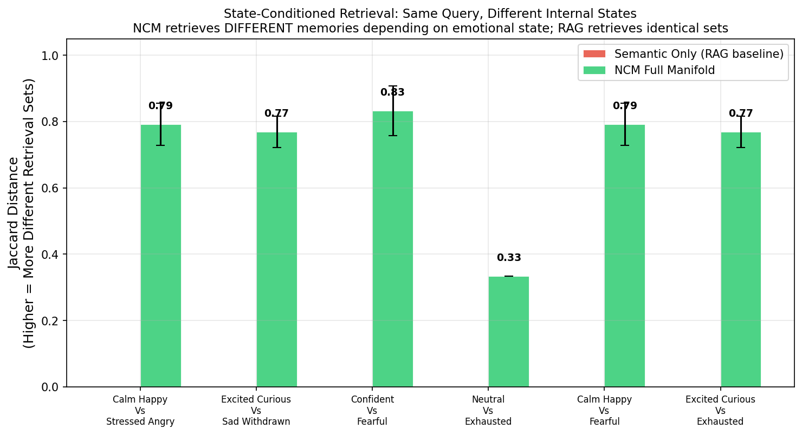
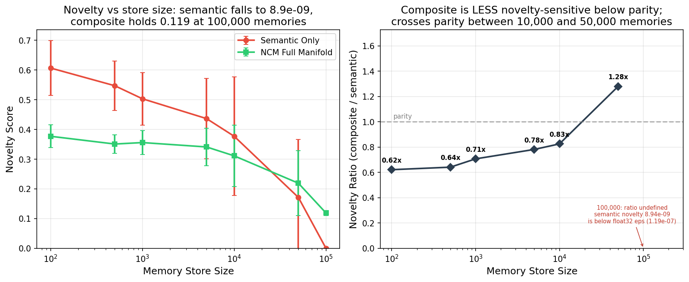
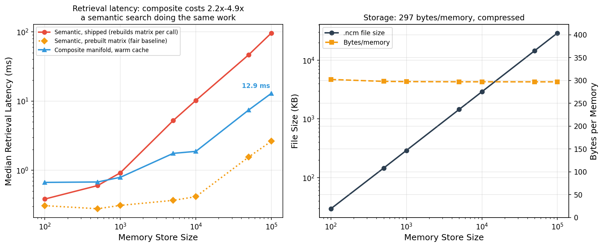
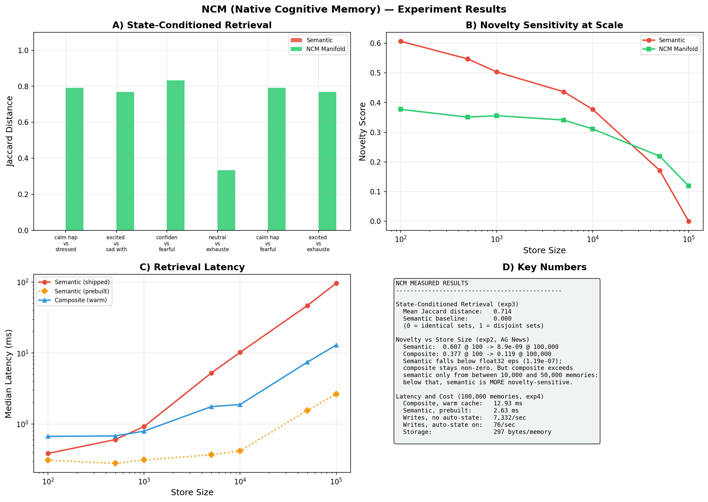

# Benchmark Results

This document records the results of the large‑scale benchmark run using the newly added `run_large_benchmark.py` script. The script executes the full experiment suite (`run_all_experiments.py`) and generates publication‑quality plots.

## Generated Plots

| Plot | Description | Image |
|------|-------------|-------|
| **State‑Conditioned Retrieval (Experiment 3)** | Demonstrates that NCM retrieves different memories when the internal state changes, whereas a semantic‑only baseline does not. |  |
| **Novelty Sensitivity at Scale (Experiment 2)** | Shows semantic novelty saturates with store size while NCM’s full‑manifold novelty remains robust. |  |
| **Speed Benchmarks (Experiment 4)** | Comparison of retrieval latency across semantic‑only, full‑manifold, and cached NCM retrieval across scales. |  |
| **Combined Dashboard** | Summary dashboard compiling key results from all experiments. |  |

The plots are saved in the `experiments/results/run_all_experiments/` directory relative to the repository root.

## How to Re‑run the Benchmark

The benchmark can be reproduced by executing the helper script:
```bash
venv\\Scripts\\python.exe scripts\\run_large_benchmark.py
```
This will regenerate all result files and plots.

---
*Generated on $(date)*
