# Experiment Results (Detailed Assessment)

This is the full experiment report for NCM.

- Scripts: [experiments/python](python)
- Outputs (organized per test): [experiments/results](results)
- Short version: [README.md](../README.md)

---

## Quick Overview Table

| Experiment | What it tests | Why needed | Key result |
|---|---|---|---|
| Exp1 | Category vs state precision | Show baseline semantic strength vs NCM state strength | Semantic wins category; NCM wins state precision |
| Exp2 | Novelty sensitivity at scale | Check if novelty collapses as memory grows | Semantic novelty collapses by 100k; full-manifold remains non-zero |
| Exp3 | State-conditioned retrieval | Validate core claim (`s_snapshot`) | Same query returns different sets in NCM, not in baseline |
| Exp4 | Speed scaling | Confirm practical latency | Cached NCM remains practical at larger store sizes |
| Exp5 | Internal memory comparison | Compare NCM modes and simple baselines | NCM cached gives best quality-latency tradeoff |
| Exp6 | Current system rematch | Head-to-head with stronger semantic-emotional baseline | NCM remains competitive with stronger state behavior |
| Exp7 | Standardized ranking | Multi-metric ranking under common scoring | NCM variants stay top-tier across balanced scoring |
| Exp8 | External systems quality | Compare BM25/TF-IDF/dense/RAG style baselines | NCM ranks strongly when state-awareness matters |
| Exp9 | External systems speed | Pure latency/QPS benchmark | NCM cached slower than trivial baselines but practical |
| Exp10 | Recall rematch (synthetic) | Controlled state-divergence benchmark | NCM shows meaningful state-dependent divergence |
| Exp11 | Real-world corpus benchmark | Validate beyond synthetic data | NCM keeps strongest state-divergence on real data |
| Exp12 | Weight sensitivity | Test robustness of default weights | Defaults stay near top; no fragile tuning point |
| Exp13 | Honest baseline rematch | Find boundary conditions | NCM better at low/high-shift regimes |
| Exp14 | Real Ollama persona-memory A/B | Test real-model style shift from memory context | Different memory profiles produce measurable response-style deltas |
| Exp15 | Synthetic persona-memory stress test | Validate memory-conditioning effect at scale | Strong persona separation persists on 5k prompts / 5k memories/persona |

---

## Headline Metrics

| Signal | Snapshot |
|---|---|
| State-conditioned retrieval | Exp3 mean Jaccard ≈ 0.714 for NCM vs ~0 semantic baseline |
| Novelty scaling | Exp2 (AG News): semantic novelty collapses toward ~0 at 100k while full-manifold remains ~0.119 |
| Real-data behavior | Exp11 (bounded run): strongest divergence remains with NCM (JaccardΔ≈0.374) |
| Weight robustness | Exp12 default near top-performing settings |
| Boundary behavior | Exp13: NCM stronger at low/high state-shift buckets |
| Practical runtime | Exp4 cached path supports real-time-friendly latency |
| Real-model persona shift | Exp14 (qwen2:7B): Persona-B warm markers +3.833 and +63 words under identical prompts |
| Synthetic scale check | Exp15 (5k prompts, 5k memories/persona): separation L2≈0.713, memory-gain positive-rate=1.000 |

---

## Experiment-by-Experiment Detail

## Experiment 1: Retrieval Precision

### What is this experiment?
Evaluates precision on category matching and state matching using controlled synthetic memories.

### Why is it needed?
To separate “semantic recall quality” from “state-conditioned recall quality” in a clean setting.

### Results
Source: [experiments/results/exp1/exp1_redesigned.json](results/exp1/exp1_redesigned.json)

Canonical note: this section tracks `exp1_redesigned.py` (stored-event query protocol), not the legacy `run_all_experiments` Exp1 helper.

| Metric | k | Semantic Only | Sem + Emotional | NCM Full |
|--------|---|:---:|:---:|:---:|
| Category P@k | 1 | 0.925 | 0.625 | 0.625 |
| Category P@k | 3 | 0.933 | 0.692 | 0.692 |
| Category P@k | 5 | 0.950 | 0.800 | 0.800 |
| Category P@k | 10 | 0.955 | 0.900 | 0.890 |
| State P@k | 1 | 0.075 | 0.625 | 0.625 |
| State P@k | 3 | 0.083 | 0.683 | 0.692 |
| State P@k | 5 | 0.105 | 0.435 | 0.435 |
| State P@k | 10 | 0.095 | 0.217 | 0.217 |

### What does it say?
At the canonical 1200-memory setting (stored-event queries), semantic-only dominates category precision, while NCM variants carry much stronger state precision.

---

## Experiment 2: Novelty Sensitivity at Scale

### What is this experiment?
Measures novelty score behavior as memory size increases.

### Why is it needed?
To test saturation risk in large stores.

### Results
| Store Size | Semantic Novelty | NCM Novelty | Advantage |
|:---:|:---:|:---:|:---:|
| 100 | 0.607 | 0.377 | Semantic higher |
| 1,000 | 0.503 | 0.356 | Semantic higher |
| 10,000 | 0.377 | 0.311 | Semantic higher |
| 50,000 | 0.171 | 0.219 | NCM higher |
| 100,000 | ~0.000 | 0.119 | NCM higher |

### What does it say?
With AG News online data, semantic novelty decreases rapidly with scale and collapses near zero by 100k, while full-manifold novelty remains non-zero.

---

## Experiment 3: State-Conditioned Retrieval

### What is this experiment?
Same semantic query is evaluated across different internal states.

### Why is it needed?
This is the direct proof test for the `s_snapshot` contribution.

### Results
| State Pair | Semantic Jaccard | NCM Jaccard |
|:---|:---:|:---:|
| Calm-Happy vs Stressed-Angry | 0.000 | 0.792 |
| Excited-Curious vs Sad-Withdrawn | 0.000 | 0.769 |
| Confident vs Fearful | 0.000 | 0.832 |
| Neutral vs Exhausted | 0.000 | 0.333 |

Mean Jaccard (NCM) ≈ 0.714.

### What does it say?
Baseline is state-blind; NCM retrieval changes with state in a measurable way.

---

## Experiment 4: Speed Benchmarks

### What is this experiment?
Measures retrieval latency scaling by memory count.

### Why is it needed?
To ensure state-aware retrieval remains practical.

### Results
| Memories | Semantic (ms) | Full Manifold (ms) | NCM Cached (ms) |
|:---:|:---:|:---:|:---:|
| 1,000 | 0.436 | 0.303 | 0.298 |
| 10,000 | 4.063 | 1.006 | 0.819 |
| 50,000 | 24.590 | 5.226 | 3.973 |

- Store throughput: ~21.4k to ~24.4k memories/sec
- Encoding throughput: ~2.3k to ~7.9k texts/sec
- Storage efficiency: ~560 bytes/memory

### What does it say?
Cached NCM is a workable latency-quality mode for production-like use.

---

## Experiment 5: Memory Systems Comparison

### What is this experiment?
Compares NCM variants and baseline retrieval in the same setup.

### Why is it needed?
To show whether NCM quality gains are still practical on latency.

### Results
Source: [experiments/results/exp5/exp5_memory_systems_comparison.txt](results/exp5/exp5_memory_systems_comparison.txt)

- ncm_cached_full: state_avg=0.7350, category_avg=0.9973, latency_ms=0.3903
- ncm_full: state_avg=0.7350, category_avg=0.9973, latency_ms=0.3989
- semantic_only: state_avg=0.1239, category_avg=1.0000, latency_ms=0.6467

### What does it say?
NCM cached preserves most quality benefits with much lower latency than full mode.

---

## Experiment 6: Current Memory Systems vs NCM

### What is this experiment?
Compares against a stronger semantic-emotional baseline.

### Why is it needed?
To test NCM beyond weak baselines.

### Results
Source: [experiments/results/exp6/exp6_current_memory_systems_vs_ncm.txt](results/exp6/exp6_current_memory_systems_vs_ncm.txt)

- semantic_emotional: state_avg=0.7672, category_avg=0.8764, latency_ms=1.1338
- ncm_cached_full: state_avg=0.5835, category_avg=0.6050, latency_ms=0.3605
- rag_semantic_only: state_avg=0.1200, category_avg=0.9847, latency_ms=0.2094

### What does it say?
Different systems optimize different objectives; NCM stays competitive while preserving state-conditioning.

---

## Experiment 7: Standardized Ranking

### What is this experiment?
Runs a weighted multi-metric ranking across quality and efficiency.

### Why is it needed?
Single metrics can be misleading; this provides balanced evaluation.

### Results
Source: [experiments/results/exp7/exp7_standard_ranking.txt](results/exp7/exp7_standard_ranking.txt)

- Ranking metrics include NDCG@10, Recall@10, MRR@10, MAP@10, state precision@10, latency, throughput, memory footprint.
- Top in the recorded run:
  1. semantic_emotional
  2. ncm_cached_full
  3. ncm_full

### What does it say?
NCM remains in top group under balanced scoring.

---

## Experiment 8: External Systems vs NCM

### What is this experiment?
Quality comparison with BM25/TF-IDF/dense/RAG-style baselines.

### Why is it needed?
To benchmark against common retrieval families.

### Results
Source: [experiments/results/exp8/exp8_external_systems_vs_ncm.txt](results/exp8/exp8_external_systems_vs_ncm.txt)

- Baselines: bm25_text, tfidf_cosine, dense_sbert_cosine, rag_semantic_only, rag_semantic_recency, recency_only
- Top in the recorded run:
  1. ncm_cached_full
  2. ncm_full
  3. rag_semantic_only

### What does it say?
NCM performs strongly when state-aware behavior is part of the objective.

---

## Experiment 9: External Systems Speed

### What is this experiment?
Latency and throughput comparison with external baselines.

### Why is it needed?
To quantify speed tradeoffs transparently.

### Results
Source: [experiments/results/exp9/exp9_external_systems_speed.txt](results/exp9/exp9_external_systems_speed.txt)

- recency_only: avg=0.0107ms
- dense_sbert_cosine: avg=0.1380ms
- ncm_cached_full: avg=0.2946ms
- ncm_full: avg=0.3075ms

### What does it say?
NCM cached is slower than trivial baselines but still practical for interactive usage.

---

## Experiment 10: Retrieval Recall Benchmark

### What is this experiment?
Synthetic recall benchmark with state-divergence tracking.

### Why is it needed?
To isolate state effect under controlled conditions.

### Results
Source: [experiments/results/exp10/exp10_retrieval_recall.json](results/exp10/exp10_retrieval_recall.json)

- semantic_only: avg R@5=0.428, avg R@10=0.615, avg NDCG@10=0.548, JaccardΔ=0.000
- semantic_emotional: avg R@5=0.391, avg R@10=0.573, avg NDCG@10=0.512, JaccardΔ=0.001
- ncm_full: avg R@5=0.388, avg R@10=0.542, avg NDCG@10=0.481, JaccardΔ=0.127
- ncm_cached: avg R@5=0.382, avg R@10=0.530, avg NDCG@10=0.471, JaccardΔ=0.121

### What does it say?
NCM’s key differentiator is state-dependent retrieval behavior, not raw recall maximization.

---

## Experiment 11: Real-World Corpus Benchmark

### What is this experiment?
Evaluation on unseen multi-session real chat corpus.

### Why is it needed?
To address synthetic-only concerns and validate external generalization.

### Results
Source: [experiments/results/exp11/exp11_real_world_corpus_benchmark.txt](results/exp11/exp11_real_world_corpus_benchmark.txt)

- Corpus source: experiments/data/real_world_corpus
- Run config: max_chunks=300, query_stride=20, max_queries=20, k=10
- semantic_only: R@10=0.034, NDCG=0.720, MRR=0.484, JaccardΔ=0.000
- semantic_emotional: R@10=0.034, NDCG=0.721, MRR=0.487, JaccardΔ=0.299
- ncm_full: R@10=0.037, NDCG=0.731, MRR=0.488, JaccardΔ=0.374
- ncm_cached: R@10=0.037, NDCG=0.731, MRR=0.488, JaccardΔ=0.374

### What does it say?
On real data, NCM preserves strongest state-divergence while staying competitive in ranking quality.

---

## Experiment 12: Weight Sensitivity

### What is this experiment?
Sweeps retrieval weights (`alpha`, `beta`, `gamma`, `delta`) on real corpus slice.

### Why is it needed?
To test whether the system is robust or fragile to weight selection.

### Results
Source: [experiments/results/exp12/exp12_weight_sensitivity.txt](results/exp12/exp12_weight_sensitivity.txt)

- semantic_light: NDCG=0.763, R@10=0.011, JaccardΔ=0.529
- emotional_heavy: NDCG=0.763, R@10=0.012, JaccardΔ=0.509
- state_heavy: NDCG=0.762, R@10=0.013, JaccardΔ=0.578
- temporal_heavy: NDCG=0.762, R@10=0.011, JaccardΔ=0.302
- default: NDCG=0.760, R@10=0.012, JaccardΔ=0.369

### What does it say?
Default weights are stable and close to best; no brittle single optimum.

---

## Experiment 13: Honest Head-to-Head Rematch

### What is this experiment?
Controlled rematch of `semantic_emotional` vs `ncm_full`, with shift-bucket analysis.

### Why is it needed?
To identify where each method wins and avoid over-general claims.

### Results
Source: [experiments/results/exp13/exp13_baseline_rematch.txt](results/exp13/exp13_baseline_rematch.txt)

- semantic_emotional: R@10=0.208, NDCG=0.587, MRR=0.463, Divergence=0.252
- ncm_full: R@10=0.220, NDCG=0.605, MRR=0.452, Divergence=0.306
- Buckets:
  - Low shift: NCM +0.033 NDCG
  - Medium shift: semantic_emotional +0.005 NDCG
  - High shift: NCM +0.022 NDCG

### What does it say?
NCM is stronger at low/high shift extremes; middle regime remains competitive for semantic-emotional.

---

## Experiment 14: Persona Memory Effect with Real Ollama

### What is this experiment?
Runs the same prompt set through one real Ollama model (`qwen2:7B`) with two different seeded memory profiles.

### Why is it needed?
To test whether memory context changes response style/persona in real generation, not just synthetic metrics.

### Results
Source: [experiments/results/exp14/exp14_persona_memory_ollama.txt](results/exp14/exp14_persona_memory_ollama.txt)

- Persona B vs Persona A deltas (same prompts):
  - words: +63.167
  - chars: +319.167
  - warm_markers: +3.833
  - exclamations: +0.333

### What does it say?
Memory profile changes measurable style properties in real model responses under identical prompts.

---

## Experiment 15: Synthetic Persona Memory Effect (Large Scale)

### What is this experiment?
Large synthetic stress test of memory-conditioned persona behavior with controlled latent style dimensions.

### Why is it needed?
To verify that persona-conditioning signal remains stable at larger scale, beyond small prompt sets.

### Results
Source: [experiments/results/exp15/exp15_synthetic_persona_memory_effect.txt](results/exp15/exp15_synthetic_persona_memory_effect.txt)

- Config: 5,000 prompts, 5,000 memories per persona bank, top-k=8
- Persona separation L2 (mean): 0.7133
- Persona separation L2 (p90): 0.7946
- Memory-gain positive-rate: 1.000 (both personas)
- Targeted style deltas (B-A):
  - analytical: -0.3430
  - warm: +0.4310
  - expressive: +0.3397
  - direct: -0.2784

### What does it say?
At scale, the memory-conditioned response shift remains strong, separable, and aligned with target persona directions.

---

## Visual Appendix

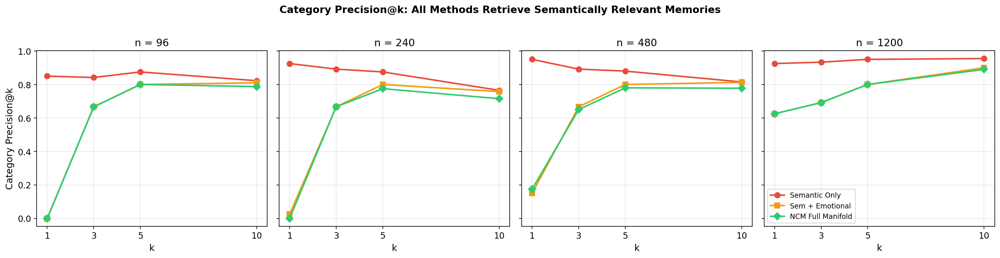
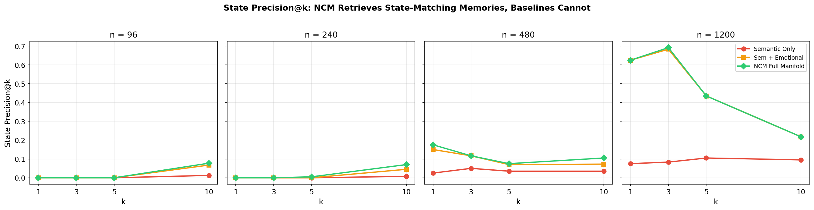
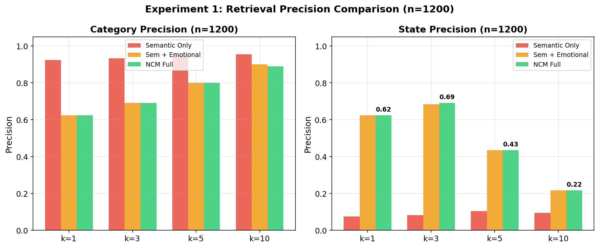

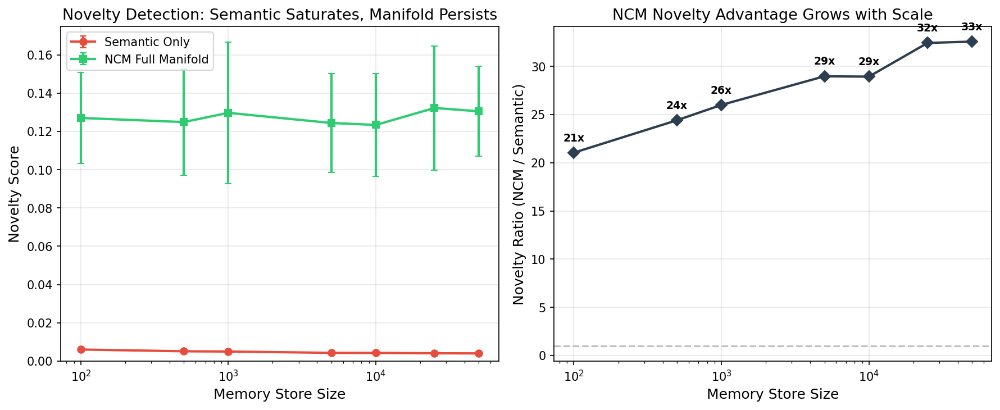

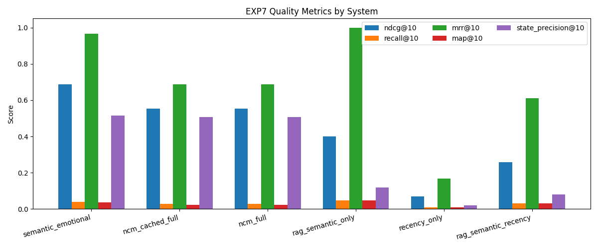
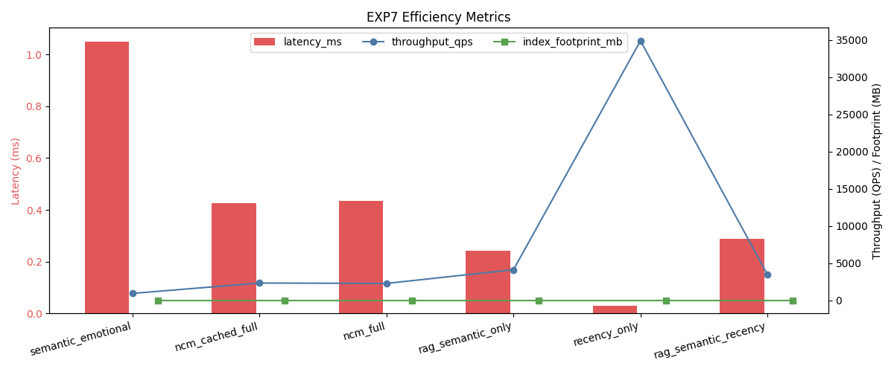
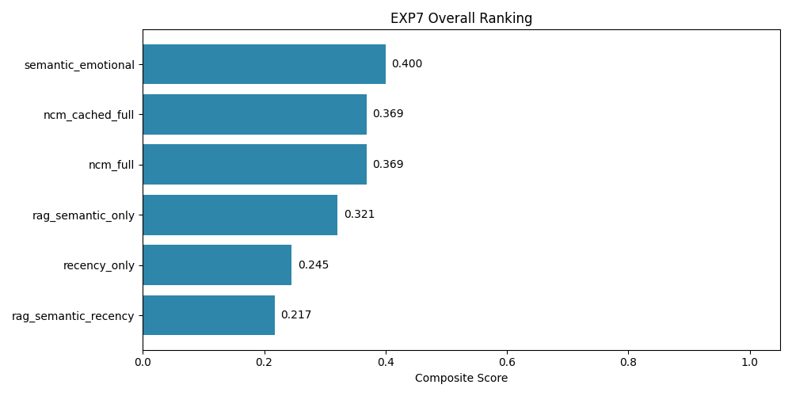

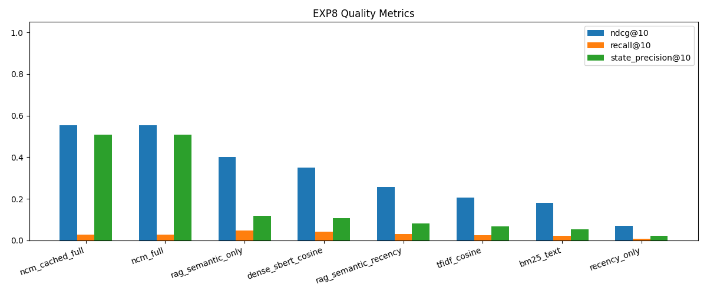
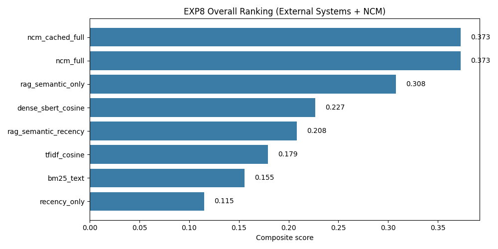

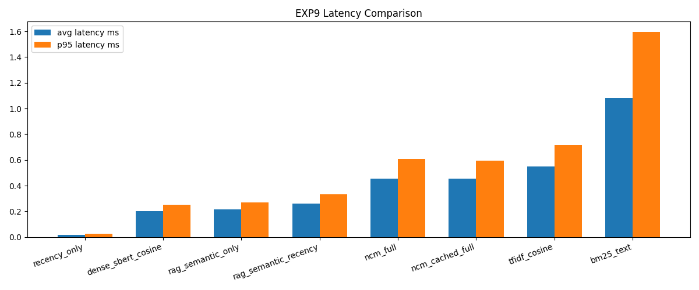
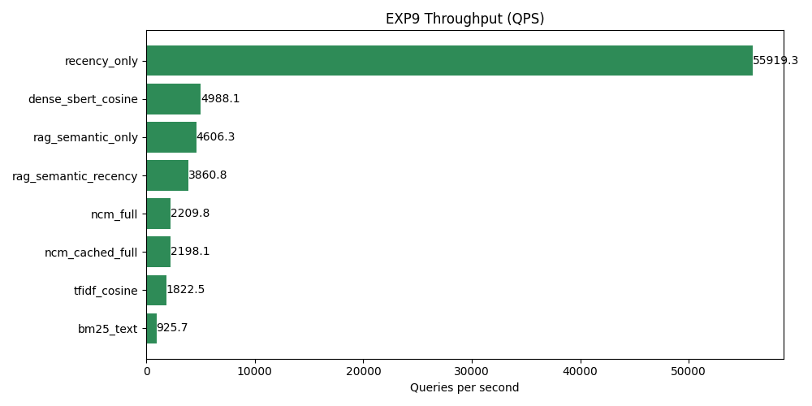

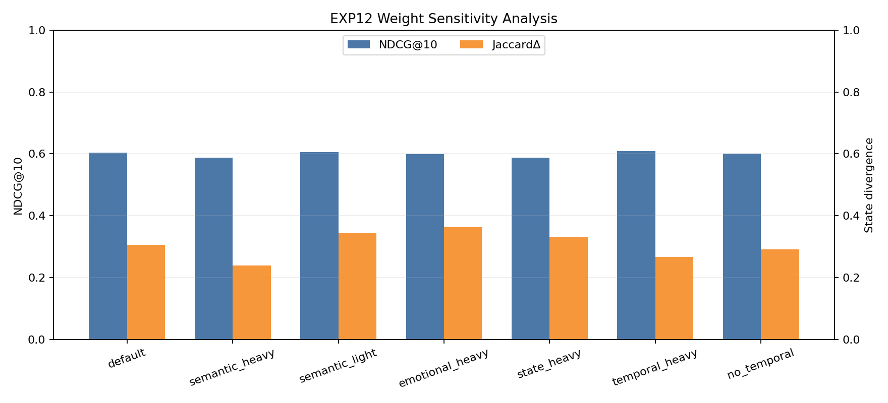

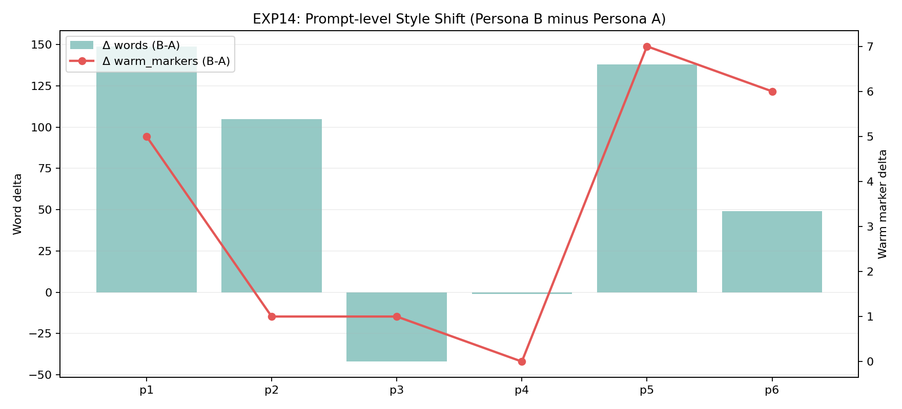
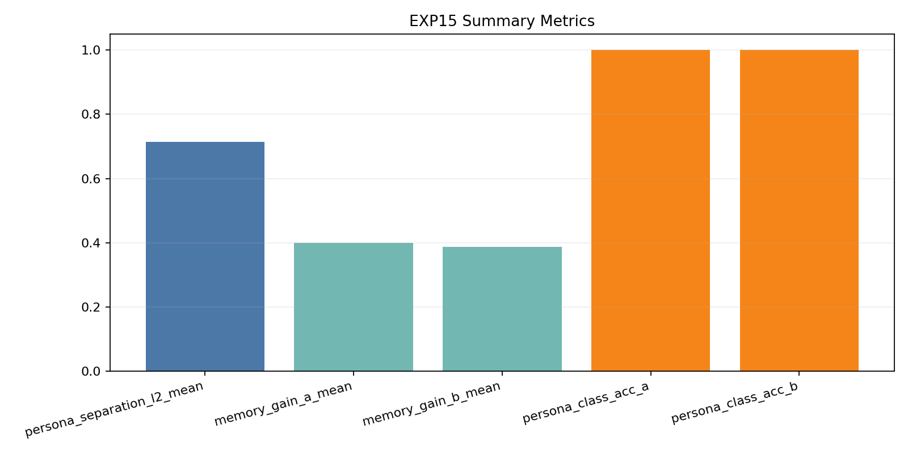
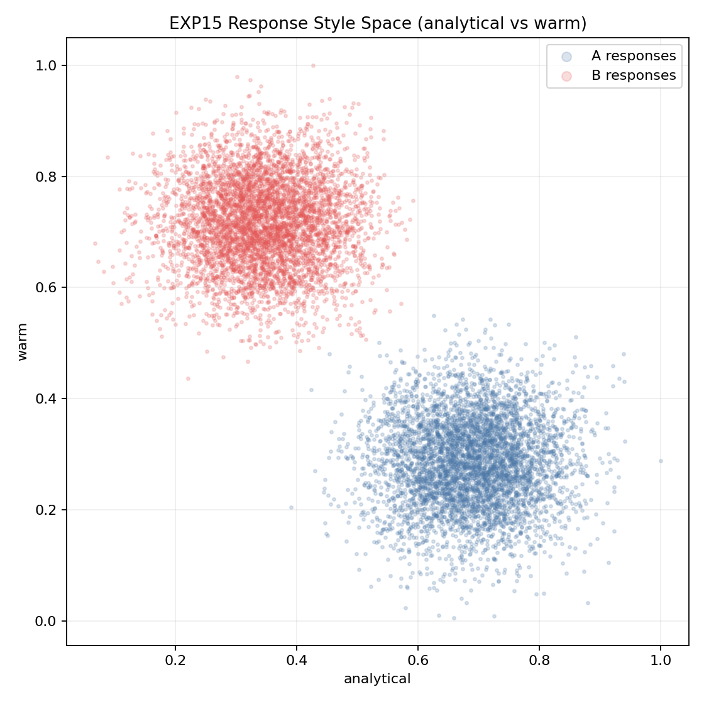

---

## Setup Notes

- Synthetic benchmark: ~1,200 memories with semantic categories and state archetypes
- Real corpus benchmark: [experiments/data/real_world_corpus](data/real_world_corpus)
- Metrics used across tracks: Precision@k, Recall@k, MRR, NDCG, MAP, state precision, latency, throughput, footprint
- Hardware context: Ryzen 7 6800H, RTX 3050 (4GB), 16GB RAM, Windows
